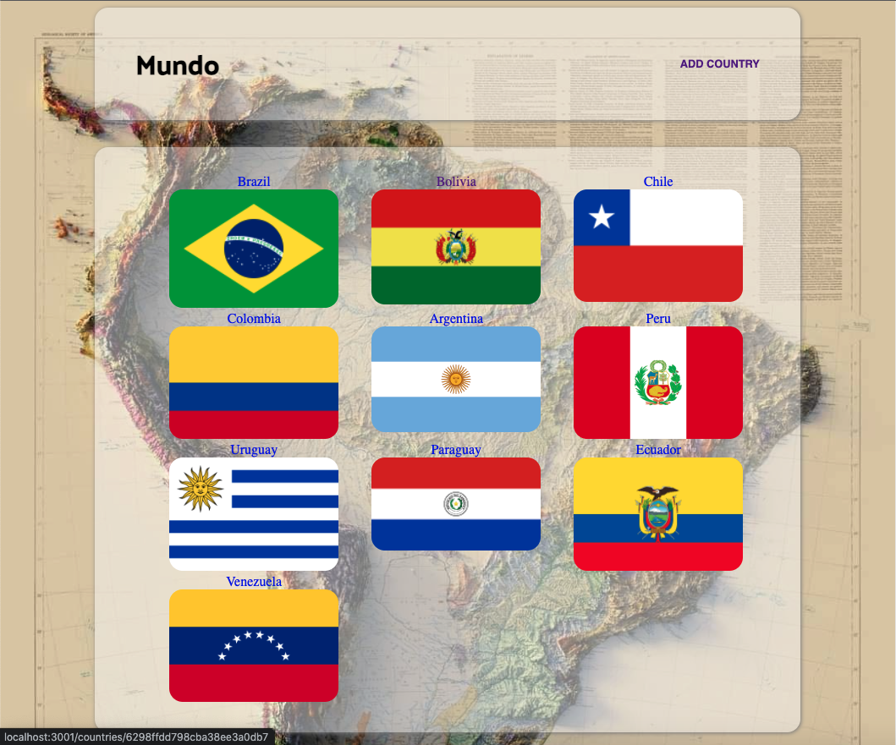
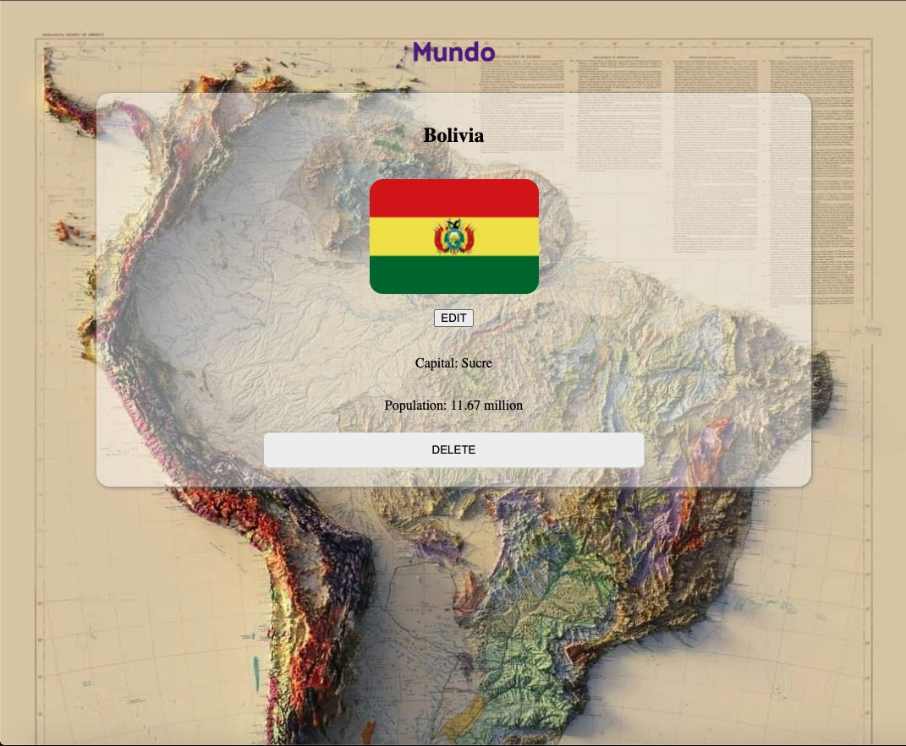
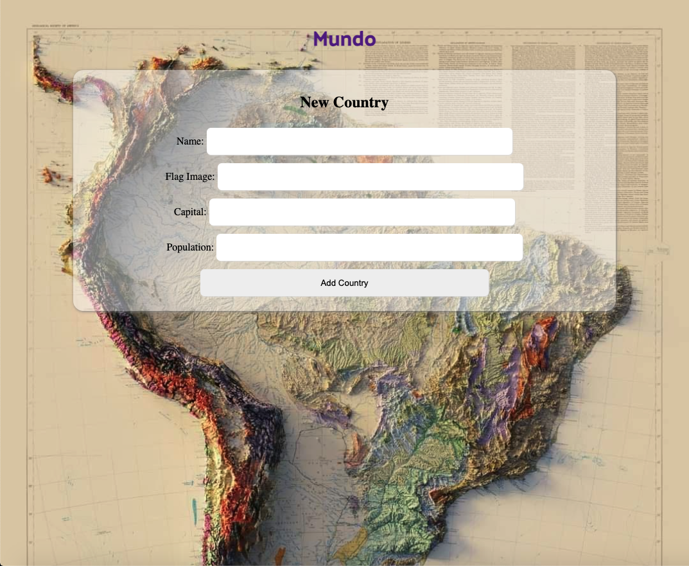
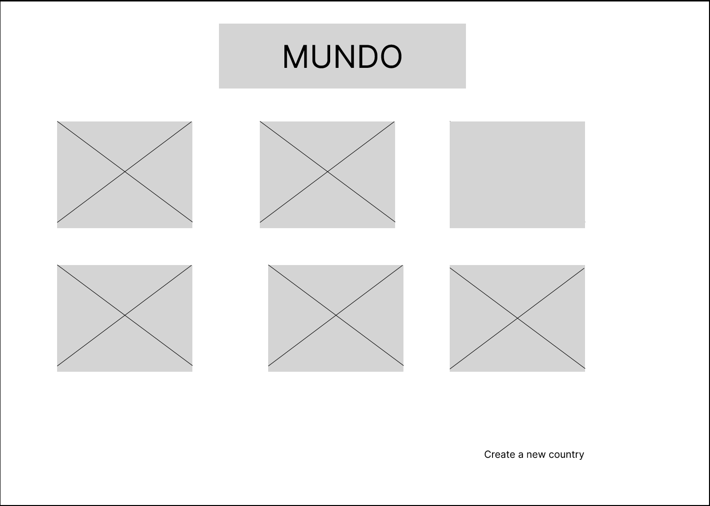

# Mundo
#### Discover South America.

## Description
Mundo is an app that provides you information and details on the countries of South America. The app will provide the user the name of the country, flag, population, and more. Features of the app include creating new countries, editing country information, and deleting countries.

## Table of Contents
* [Technologies Used](#technologiesused)
* [Features](#features)
* [Design](#design)
* [Project Next Steps](#nextsteps)
* [Deployed App](#deployment)
* [About the Author](#author)

## Technologies Used
* JavaScript
* HTML5
* CSS3
* MongoDB

## Features
* Features of the app include creating new countries, editing country information, and deleting countries.

## Wireframe
* 

## Trello Planning
* Link to Trello: https://trello.com/b/4VC6zlmb/project-two

## Design
* Design elements implemented using CSS

## Deployed Link
* N/A

* You can view the deployed app here:
[Click Here](https://mundo13.herokuapp.com/countries)

    
## Works Cited:
* https://www.w3schools.com/

## About The Author
I am a developer that builds applications that are closely tied to personal interests of mine. I use CSS, HTML, and Javascript to develop my applications.

## Future Enchancements
* Users will be able to view the country through a Google Maps interactive window.